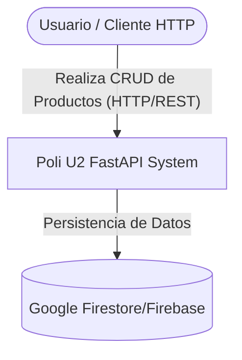
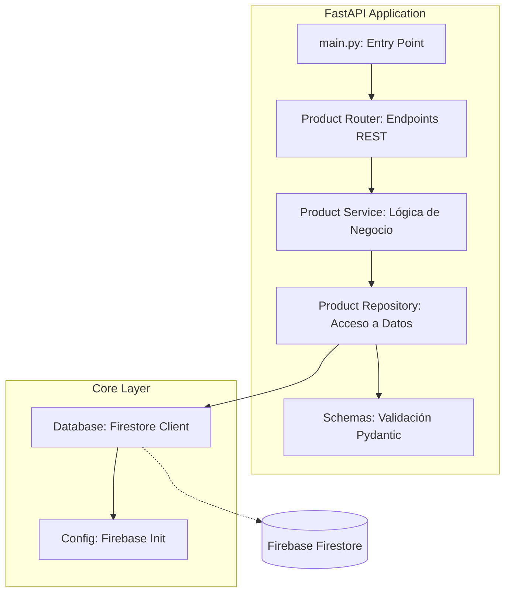

# Arquitectura del Sistema - Poli U2 REST Fast API

Este documento detalla la arquitectura, decisiones de diseño y justificación técnica del proyecto desarrollado para la Unidad 2 de la asignatura Arquitectura de Aplicaciones Web.

## 1. Diagramas de Arquitectura (Modelo C4)

### 1.1 Diagrama de Contexto (Nivel 1)
Describe la relación del sistema con los usuarios y servicios externos.

### 1.2 Diagrama de Contenedores / Componentes (Nivel 2/3)
Muestra la distribución interna del API basada en una arquitectura por características (Feature-based).

---

## 2. Descripción de la Distribución del API

El proyecto utiliza una **Arquitectura Basada en Características (Feature-based Architecture)**, lo que permite una alta cohesión y bajo acoplamiento.

### Estructura de Directorios:
- **`app/core/`**: Contiene la configuración global y la lógica de conexión a la infraestructura (Firebase).
    - `config.py`: Carga variables de entorno y gestiona el SDK de Firebase Admin.
    - `database.py`: Provee una instancia única (Singleton) del cliente de Firestore.
- **`app/features/products/`**: Módulo autónomo que gestiona la entidad `Producto`.
    - `router.py`: Define los contratos de la interfaz (Endpoints), métodos HTTP y códigos de respuesta.
    - `service.py`: Actúa como mediador, aplicando reglas de negocio antes de la persistencia.
    - `repository.py`: Encapsula toda la interacción con Firestore (Patrón Repository).
    - `schemas.py`: Modelos de datos `Pydantic` para validación de contratos (Request/Response).
- **`main.py`**: Punto de entrada que orquestra la carga de módulos y la configuración del framework.

---

## 3. Justificación vs Rúbrica de la Actividad

A continuación se detalla cómo la implementación cumple con los criterios de evaluación:

| Criterio | Elección Técnica | Justificación (Rúbrica) |
| :--- | :--- | :--- |
| **Arquitectura de la Solución** | **Feature-based Architecture** | Organización en paquetes claros y módulos independientes. Facilita el mantenimiento y la escalabilidad (SOLID). |
| **Implementación CRUD** | **FastAPI + Firebase SDK** | Implementación completa de Crear, Leer, Actualizar y Eliminar con manejo de errores global. |
| **Uso de ORM / ODM** | **Firestore Admin SDK** | Uso del SDK oficial que abstrae las consultas SQL/NoSQL manuales, cumpliendo con la función de un ODM para BD NoSQL. |
| **Manejo de Errores** | **HTTP Exceptions** | Uso de `HTTPException` de FastAPI para devolver códigos de estado semánticos (404, 201, 204, 400). |
| **Pruebas** | **Script de Automatización** | Se incluye `test_api.py` que evidencia el correcto funcionamiento de todos los métodos HTTP. |

---

## 4. Principios Aplicados

1. **SOLID**:
    - **Single Responsibility**: Cada archivo tiene una única razón para cambiar.
    - **Dependency Inversion**: El router depende del servicio y este del repositorio.
2. **YAGNI (You Ain't Gonna Need It)**: Se evitó añadir autenticación o lógicas complejas no solicitadas en la rúbrica para mantener el código simple y directo.
3. **GRASP (General Responsibility Assignment Software Patterns)**:
    - **Experto en Información**: El `ProductRepository` es el único que sabe cómo interactuar con Firestore.
    - **Controlador**: El `router.py` maneja exclusivamente la entrada de peticiones.
4. **Modelo de Madurez de Richardson (Nivel 2)**:
    - Uso de **Recursos** (`/products`).
    - Uso de **Verbos HTTP** semánticos para cada acción.
    - Respuestas detalladas con códigos de estado apropiados.

---

## 5. Resumen de lo Solicitado vs Ejecutado

| Lo Solicitado | Lo Ejecutado |
| :--- | :--- |
| Entidad Producto (id, nombre, desc, precio) | Implementado con validación estricta de tipos en `schemas.py`. |
| CRUD Completo | Implementado y verificado mediante `test_api.py`. |
| Integración con Base de Datos | Conexión exitosa con **Firebase Firestore**. |
| Video Explicativo | Estructura preparada para ser narrada paso a paso siguiendo el flujo `Router -> Service -> Repo`. |

---
