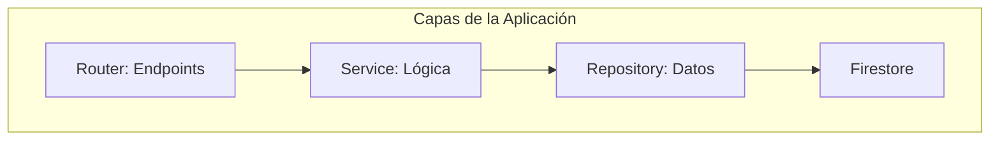
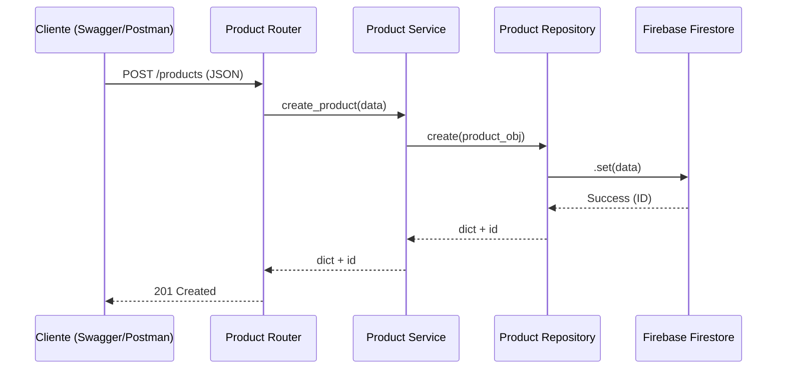

# Guía para Video Explicativo - Unidad 2

Este documento sirve como guion y guía visual para la grabación de tu video de 15 minutos. Incluye diagramas Mermaid, estructura de narración y los puntos exactos donde debes tomar capturas o grabar pantalla.

---

## 📸 Resumen de Capturas Necesarias (Screenshots)
Para tu entrega escrita o diapositivas, toma capturas en estos puntos:
1.  **Estructura del Proyecto**: Expande el árbol de carpetas en VS Code.
2.  **Conexión Firebase**: Archivo `app/core/config.py` y el archivo `serviceAccountKey.json` (solo la parte inicial).
3.  **Swagger UI**: Pantalla de `http://localhost:8000/docs`.
4.  **Consola Firebase**: Vista de la colección `productos` con los datos que insertamos.
5.  **GitHub Repo**: Pantalla principal de tu repositorio en la web (`github.com/jhoney787813/...`).

---

## 📽️ Estructura del Video (Guion Sugerido)

### Parte 1: Introducción y Arquitectura (3-4 min)
**Qué mostrar:** VS Code con el archivo `ARCHITECTURE.md` o el árbol de carpetas.

**Narración:**
*   "Hola, mi nombre es [Tu Nombre]. En este video explicaré el desarrollo de una API RESTful usando FastAPI y Firebase para la Unidad 2."
*   "He seleccionado una **Arquitectura Basada en Características (Feature-based)**..."

**Diagrama de Arquitectura (Nivel 2):**


### Parte 2: Construcción Paso a Paso (3-4 min)
**Puntos clave del código:**
1.  **Core (`app/core/config.py` y `database.py`)**: Muestra cómo se inicializa el Singleton de Firebase.
2.  **Schemas (`app/features/products/schemas.py`)**: Muestra la validación con Pydantic.
3.  **Repository (`app/features/products/repository.py`)**: Explica que aquí se encapsula el SDK de Firebase (SOLID).

> [!TIP]
> **Captura aquí:** Resalta la función `create` y `get_all` en el Repository para mostrar el uso del SDK.

### Parte 3: Funcionamiento del CRUD (4-5 min)
**Qué mostrar:** El navegador con `http://localhost:8000/docs`.

**Pasos a seguir en vivo:**
1.  **GET /products**: Muestra que ya hay datos (los que insertamos con el seed).
2.  **POST /products**: Crea un producto nuevo (ej: "Producto Video").
3.  **PUT /products/{id}**: Modifica el precio del producto creado.
4.  **DELETE /products/{id}**: Elimina un registro para mostrar el código `204 No Content`.

> [!IMPORTANT]
> Muestra también la **Consola de Firebase** en otra pestaña para probar que los datos realmente cambian en la nube en tiempo real.

### Parte 4: GitHub y Repositorio (2-3 min)
**Qué mostrar:** La terminal y luego tu cuenta de GitHub.

**Narración:**
*   "Para el control de versiones, configuré una llave SSH para una conexión segura sin contraseñas..."
*   Muestra el comando `git remote -v` en la terminal para evidenciar el origen SSH.
*   "El código está alojado en GitHub en la siguiente URL..."

**Acciones en video:**
*   Abre tu repositorio en el navegador.
*   Muestra el archivo `README.md` y `JUSTIFICACION_RUBRICA.md` que cargamos.

---

## 🛠️ Comandos Útiles para el Video

Si necesitas "re-hacer" algo durante el video para que se vea en vivo:

**Para iniciar el servidor:**
```bash
uvicorn main:app --reload
```

**Para mostrar la vinculación a GitHub:**
```bash
git log -n 1
git status
```

---

## 📈 Diagrama de Flujo de una Petición (Usa esto en tu presentación)

